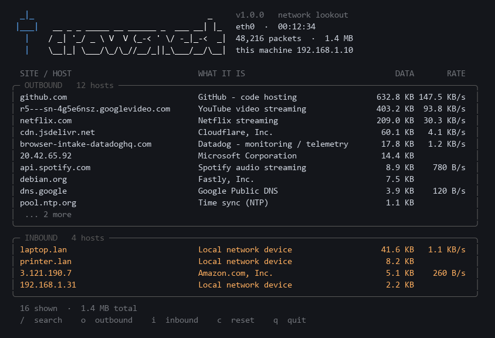

# crowsnest

**Wireshark tells you everything. crowsnest tells you who.**

Wireshark shows you every packet. Usually you only want the answer to one
question: *what is this machine talking to, and what is talking to it?*
crowsnest reads the same traffic and tells you that, in plain language.



It reports each host **once**, when it first appears, and then stays quiet:

```
crowsnest live  ·  eth0  ·  this machine 192.168.1.120
  each host is reported once, when first seen. Ctrl-C for a summary.

  08:22:13  ↑  github.com                     GitHub - code hosting
  08:22:13  ↑  ord37s57-in-f10.1e100.net      Google infrastructure
  08:22:13  ↑  browser-intake-datadoghq.com   Datadog - monitoring / telemetry
  08:22:14  ↑  20.42.65.92                    Microsoft Corporation
  08:22:19  ↓  laptop.lan                     Local network device
  08:22:24  ↓  203.0.113.5                    DigitalOcean, LLC
```

`↑` means this machine started the connection. `↓` means something else did.
`--dashboard` gives you the framed view in the picture instead, with transfer
rates and a search box.

> **What it cannot show you.** Almost all traffic is encrypted, so crowsnest
> reports *which hosts* were contacted — from DNS lookups and the server name in
> the TLS handshake. Never page contents, never URLs. That is the limit for
> anything reading packets, not a shortcoming of this tool.

## Install

Pick the line for your system.

**macOS**

```bash
brew install t0mbo192/tap/crowsnest
```

**Raspberry Pi OS, Debian or Ubuntu** — download `crowsnest_<version>_all.deb`
from [Releases](https://github.com/t0mbo192/crowsnest/releases), then:

```bash
sudo apt install ./crowsnest_1.1.4_all.deb
```

**Windows** — in PowerShell:

```powershell
irm https://raw.githubusercontent.com/t0mbo192/crowsnest/main/install.ps1 | iex
```

Then open a new terminal, so it can find the `crowsnest` command.

**Any other Linux**

```bash
curl -fsSL https://raw.githubusercontent.com/t0mbo192/crowsnest/main/install.sh | bash
```

### One more step

crowsnest can name the company behind an address that has no name of its own —
"Microsoft Corporation" instead of `20.42.65.92`. That needs a small database,
downloaded once:

```bash
crowsnest asn --fetch
```

### What it needs

**Wireshark**, because crowsnest reads packets using its `tshark` program. The
macOS and Debian installs above pull it in for you. The Windows and Linux
scripts check whether you have it, and offer to install it if you say yes.

Nothing is installed without asking first. The Windows install needs no
administrator rights at all; the Debian one uses `sudo`, as installing any
package does.

## Use

```bash
sudo crowsnest live --dashboard                # the view in the picture above
sudo crowsnest live                            # or a plain list, one line per host
crowsnest read capture.pcapng                  # or read a saved Wireshark capture
crowsnest interfaces                           # what could I watch?
```

You do not have to know which network interface to use. `live` lists them, marks
the one your traffic actually goes through, and asks — press Enter to take it.
Pass `-i` to skip the question, with either a number from that list or a name
like `eth0` or `en0`.

Watching live traffic needs privileges: run it with `sudo`, or an administrator
terminal on Windows. Reading a saved capture needs nothing.

Press `Ctrl-C` to stop, and it prints a summary of everything it saw.

**In the dashboard:** `/` to search, `o` and `i` to open a panel, `c` to reset,
`q` to quit.

**Useful extras:** `--duration 60` stops on its own after a minute.
`--filter 'not port 22'` ignores your own SSH session. `--json` or
`--csv report.csv` on `read` gives you the results as data.

`crowsnest --help`, or `crowsnest live --help`, lists everything.

## Updating

| Installed with | Update |
|---|---|
| Homebrew | `brew upgrade crowsnest` |
| the `.deb` | download the new one and `sudo apt install ./…deb` over it |
| a script | run the same install line again |

`crowsnest update` tells you whether there is a newer version.

## Two more things it can do

**Shut a host out.** Once you can see who is reaching the machine, `crowsnest
block` can stop them — on Linux, with guardrails so you cannot cut off your own
gateway, your DNS, or the SSH session you are typing into.
See [docs/blocking.md](docs/blocking.md).

**Watch a phone.** A phone cannot run crowsnest, but it can join a WireGuard
tunnel to a Raspberry Pi, and then everything it talks to appears here — on
Wi-Fi and on cellular. [docs/setup-wireguard.sh](docs/setup-wireguard.sh) sets
that up; [docs/cellular.md](docs/cellular.md) covers making it work away from
home.

## Licence

crowsnest is [MIT](LICENSE). Working on it? See
[docs/development.md](docs/development.md).

Captures contain real addresses and browsing history, so `*.pcap*` is never
committed to this repository. Address lookups happen on your machine — nothing
about your traffic is sent anywhere.

The address database is not part of this repository. `crowsnest asn --fetch`
downloads it from DB-IP, whose licence asks for the credit:

> IP-to-ASN data by [DB-IP](https://db-ip.com) — licensed under
> [CC-BY 4.0](https://creativecommons.org/licenses/by/4.0/).
