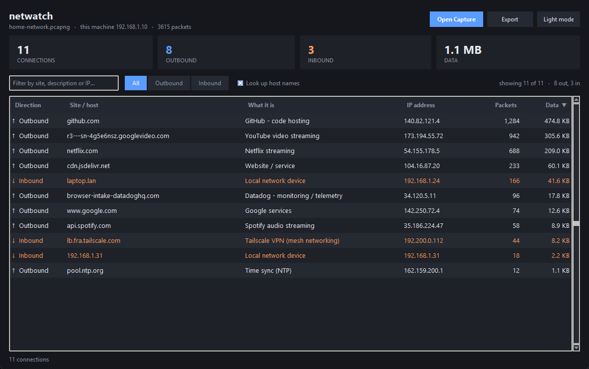

# netwatch

**Wireshark, simplified.** Point it at a packet capture and it tells you — in
plain English — every site your machine connected to, everything that connected
back to it, and what each of those hosts actually *is*.

Wireshark shows you *everything*; that's the problem. `netwatch` distills a
`.pcapng` down to the blatant facts:

- **Outbound** — sites *you* connected to
- **Inbound** — hosts that connected to *you*
- **A short description** of each host (CDN, telemetry, Google, VPN, streaming,
  local device …)
- **Filtering** by text or direction



It reads captures with `tshark` (bundled with Wireshark), works out which machine
is "you" from the traffic, and decides direction from the TCP handshake —
whoever sends the opening SYN started the connection.

> **Encryption note:** modern traffic is HTTPS, so netwatch shows *which hosts*
> were contacted (from DNS and the TLS SNI), never page content or URLs. That's
> the ceiling for any capture-based tool.

## Components

| File | What it is |
|------|-----------|
| `netwatch_live.py` | **Live terminal view** — watch connections form in real time, no display needed. Works over SSH on a headless Pi. |
| `connection_viewer.py` | **Desktop app** with dark and light themes: a sortable, filterable table of inbound/outbound connections, each host tagged with a plain-English description. Builds into a standalone `.exe`. |
| `netwatch_core.py` | Shared analysis: direction, host names, descriptions. No GUI imports, so it works headless. |
| `analyze_capture.py` | CLI: hosts grouped by root domain, allowlist flagging, optional GeoIP, CSV export. |
| `pcap_report.py` | Prints a simple two-section (outbound / inbound) text report. |
| `analyze_gui.py` | An earlier, fuller GUI (allowlist, GeoIP, flagged-only). |

## Requirements

- **Wireshark**, which provides `tshark` — <https://www.wireshark.org>.
  On Debian / Raspberry Pi OS: `sudo apt install tshark`
- **Python 3.10+** (only to run from source or rebuild the `.exe`)
- **Tkinter**, for the GUI. It ships with Python on Windows and macOS; on
  Debian / Raspberry Pi OS install it with `sudo apt install python3-tk`.

No third-party Python packages are required — everything runs on the standard
library, which keeps installation on a Raspberry Pi to the two `apt` lines above.

## Usage

### Live, in a terminal

Watch connections as they happen — no capture file, no display, so it works over
SSH on a headless Pi:

```bash
sudo python3 netwatch_live.py --list        # which interfaces can I watch?
sudo python3 netwatch_live.py -i eth0      # watch that one
```

```
netwatch live  ·  eth0  ·  00:00:10  ·  2,795 packets  ·  this machine 192.168.0.120

     SITE / HOST                        WHAT IT IS                   DATA       RATE
  ↑  ord37s57-in-f10.1e100.net          Google infrastructure       2.3 MB 243.5 KB/s
  ↑  github.com                         GitHub - code hosting     611.1 KB          -
  ↑  mobile.events.data.microsoft.com   Microsoft services         12.3 KB          -
  ↓  laptop.lan                         Local network device        4.2 KB    1.1 KB/s

  18 connections (14 out, 4 in)  ·  2.9 MB total  ·  10 more
```

Useful flags: `--top N` rows, `--interval` redraw seconds, `--plain` to log each
new host instead of redrawing, `--duration N` to stop automatically, `--me IP` if
it guesses the wrong local address. Ctrl-C prints a full inbound/outbound summary.

Live capture needs privileges — run with `sudo`, or
`sudo usermod -aG wireshark $USER` and log back in.

### From a saved capture

Capture traffic in Wireshark (or anything that saves a `.pcapng`), then:

```bash
# Desktop GUI
python connection_viewer.py                     # opens a window; Open a capture

# CLI report (grouped hosts + endpoints)
python analyze_capture.py capture.pcapng --rdns

# Simple inbound/outbound text report
python pcap_report.py capture.pcapng
```

## Installing

**Windows** — download `netwatch-setup-<version>.exe` from
[Releases](https://github.com/t0mbo192/netwatch/releases) and run it. It installs
per-user (no admin prompt), adds a Start Menu entry and an uninstaller, creates
the `Documents\Captures` drop folder, and warns you up front if Wireshark is
missing. A portable `ConnectionViewer.exe` is attached to each release too, if
you'd rather not install anything.

**Raspberry Pi / Linux** — run from a git clone; there is no build step, because
the app is pure Python:

```bash
sudo apt install tshark python3-tk
git clone https://github.com/t0mbo192/netwatch.git
cd netwatch && ./install-pi.sh
```

That adds a `netwatch` command and an applications-menu entry, and checks the
dependencies. It never invokes `sudo` itself — if something is missing it prints
the command for you to run.

## Updating

netwatch checks for a newer version on startup, in the background, and shows an
**Update** button in the header if it finds one. It never downloads or installs
anything on its own; the button just tells you how to take it.

| Install type | How it checks | How you update |
|---|---|---|
| git clone (Pi) | compares your checkout against its upstream branch | `git pull`, then restart |
| Installer / portable `.exe` | reads the latest GitHub Release | download and run the new installer |

Check from the command line at any time:

```bash
python updater.py
```

> While the repository is private, the Release check needs a GitHub token —
> set `NETWATCH_GITHUB_TOKEN`, or add `"github_token"` to `~/.netwatch.json`.
> The git route needs no token, and neither does anything once the repo is
> public. A failed check is silent apart from a status-bar note.

## Releasing

Version lives in one place, [`netwatch_version.py`](netwatch_version.py). Pushing
a tag builds and publishes everything:

```bash
git tag v1.0.1 && git push origin main --tags
```

[`.github/workflows/release.yml`](.github/workflows/release.yml) then builds the
app with PyInstaller, wraps it with [Inno Setup](packaging/netwatch.iss), and
publishes both to a GitHub Release. It **fails the build if the tag disagrees
with `netwatch_version.py`**, so a mislabelled version can't ship. To rehearse
without publishing, run the workflow manually from the Actions tab with
`dry_run` left on.

Building locally, if you want to:

```bash
python -m PyInstaller --onefile --windowed --name ConnectionViewer connection_viewer.py
```

## Running on a Raspberry Pi

The intended deployment is a Pi acting as a network monitor on an attached
display — see [Installing](#installing) above for the setup commands.

The dark theme is the default, which suits an always-on monitor, and the stat
cards are sized to read from across a room. Your theme choice is remembered in
`~/.netwatch.json`.

On a **headless** Pi, use the command-line tools instead — `analyze_capture.py`
and `pcap_report.py` print to the console and need no display. A headless build
of the direction + descriptions view is a natural next step.

## Privacy

Capture files contain your real IP addresses and browsing, so `*.pcapng` /
`*.pcap` are git-ignored and never committed. Host descriptions come from a small
built-in keyword table — nothing leaves your machine unless you explicitly pass
`--geoip` to `analyze_capture.py`.

## License

[MIT](LICENSE)
